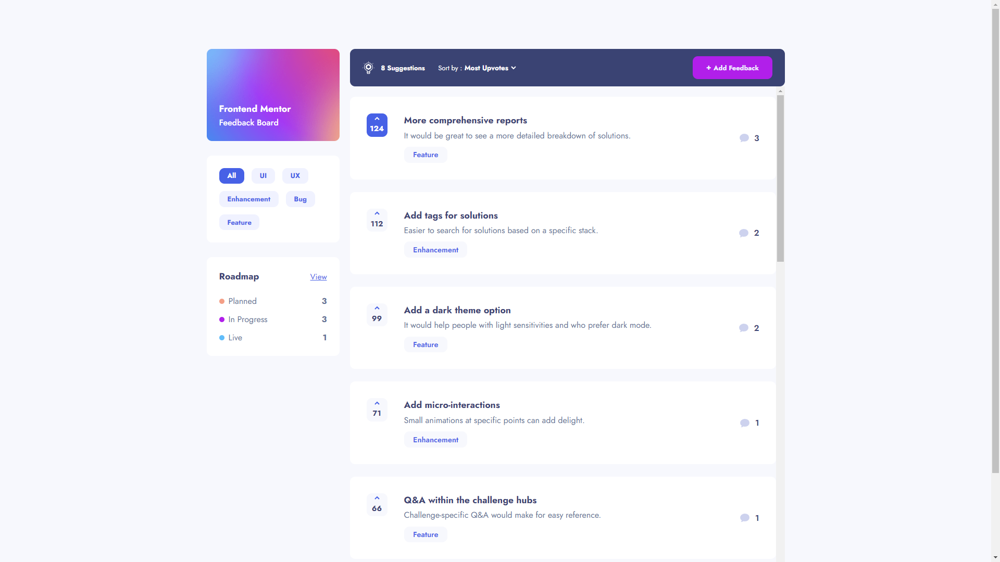

# Frontend Mentor - Product feedback app solution

This is a solution to the [Product feedback app challenge on Frontend Mentor](https://www.frontendmentor.io/challenges/product-feedback-app-wbvUYqjR6). 

It's the hardest challenge on Frontend Mentor and is currently marked "Level 5 - Guru". The Figma files were provided, and I aimed for a pixel-perfect implementation with this one.  

Frontend Mentor challenges help you improve your coding skills by building realistic projects.

## Table of contents

- [Overview](#overview)
  - [Using this repo](#using-this-repo)
  - [The challenge](#the-challenge)
  - [Screenshot](#screenshot)
  - [Links](#links)
- [My process](#my-process)
  - [Built with](#built-with)
  - [What I learned](#what-i-learned)
  - [Continued development](#continued-development)
  - [Useful resources](#useful-resources)
- [Author](#author)
- [Acknowledgments](#acknowledgments)

## Overview

### Using this repo

If you do decide to fork this repo, let me know how you used it on [LinkedIn](https://www.linkedin.com/in/victor-nyagudi-016063148/) or [Twitter](https://twitter.com/Vicktor_Oti). 

I'd love to hear about what you used it for and how it helped you. 😊

You can use the code to practice working with a backend, or even use it as a foundation for teaching students how to use a backend with a professional-looking front end already set up.

I used JSON server to mock a REST API, so you'll need to run the `npm run json-server` script after `npm start` in the terminal to see any feedback items, otherwise the app will prompt you to add suggestions, which you also won't be able to do until JSON server is running or you hook up your own back end.

Alternatively, you could change the feedback items passed down to the pages in `App.js` from `db.json` (the one JSON server uses) to `data.json` (the default JSON data that came with the challenge).

Here's a [demo of the app working with json server](https://youtu.be/4LcdKqsm5e0).

I made some changes to the original JSON data provided so that it's more in line with the actual data you'd get from a database. For example, in the original data, if a feedback item didn't have any comments, the `comments` property was omitted instead of it being equal to an empty array.

With the `id` also not being database-generated, I resorted to a poor man's system of creating them, so you could run into the issue of identical id's.

With the way I've set things up, I do believe if you returned data from a backend that's exactly like the one in `db.json`, you'd have to do minimal set up to get things working, but if issues arise, feel free to let me know in the [issues tab](https://github.com/Victor-Nyagudi/product-feedback-app-react/issues).

Happy coding!

### The challenge

Users should be able to:

- View the optimal layout for the app depending on their device's screen size
- See hover states for all interactive elements on the page
- Create, read, update, and delete product feedback requests
- Receive form validations when trying to create/edit feedback requests
- Sort suggestions by most/least upvotes and most/least comments
- Filter suggestions by category
- Add comments and replies to a product feedback request
- Upvote product feedback requests
- **Bonus**: Keep track of any changes, even after refreshing the browser (`localStorage` could be used for this if you're not building out a full-stack app)

### Screenshot

I've included 6 screenshots in the `/src/screenshots` folder: desktop implementation, tablet (portrait and landscape), and mobile (portrait and landscape).

### Links

- [Solution](https://www.frontendmentor.io/solutions/product-feedback-app--J1n6KJ6Bs)
- [Live Site](https://react-product-feedback-app.netlify.app/)

## My process

### Built with

- [React](https://reactjs.org/) - JS library
- [React Router](https://reactrouter.com/en/main)
- [Json Server](https://www.npmjs.com/package/json-server#https) - Mock REST API
- SCSS
- Flexbox
- CSS Grid
- Mobile-first workflow
- BEM Naming Convention

### What I learned

I initially set a 14-day deadline to complete this challenge, but it turns out there was much more to do than what could be achieved in that timeline, especially considering my aim was a pixel-perfect implementation.

It ended up taking about 19 days to get to a satisfactory state, but after taking on a project this size, I learned that there will always be little things popping up that need fixing. 

Earlier solutions were simpler and had a finite ending, but a larger project with more interactions will often have some unexpected bugs. This is reminiscent of the big applications that exist today, whether corporate or even video games - the more things you add, the likelier you are to introduce/encounter bugs.

That's why there are developers constantly working on them, otherwise, the app would be built once, and developers would have to look for work elsewhere when done. 

I also learned a lot about patience and getting out of the mindset of "there's just this one little thing left, and I'm done". 

Granted, with a robust structure to an app, small adjustments shouldn't be breaking changes, but in larger projects, many areas could be depending on the area being changed, so caution has to be taken to ensure those other areas aren't adversely affected.

On the coding side of things, I'm glad I got some practice using [Context](https://reactjs.org/docs/context.html#consuming-multiple-contexts) in React. It saved me from the headaches that come with [prop drilling](https://www.geeksforgeeks.org/what-is-prop-drilling-and-how-to-avoid-it/), which almost happened once where I had to pass the currently authenticated user to a component deep in the UI tree. 

I'm also happy I got some practice with React Router, JSON server, and using JavaScript's `fetch` API to get data from the local JSON server. 

### Continued development

I learned a great deal about deadlines, so I'll use this knowledge to pace myself better and make more informed decisions (maybe not code for basically 21 days straight 😂). 

Despite working with Context in this project, there are still some advanced React concepts I'd like to get some more experience with, but that should come the more I use the framework.

I'm happy with the way I planned and structured everything from the beginning, and I'd like to build on this by implementing some things early on rather than doing one large pass through towards the end e.g. accounting for accessibility as I'm building, adding `prop` restrictions with `prop-type` while coding the component instead of after, etc.

Finally, I'd like to improve on just the awareness of simple concepts e.g. not being confused why the property returned is `undefined` when the variable is actually an array and not an object 😂. It's not an issue, but I do have some occassional [brain farts](https://www.dictionary.com/browse/brain-fart) every now and then.

### Useful resources

- [Traversy React Crash Course](https://www.youtube.com/watch?v=w7ejDZ8SWv8&t=5511s) - I watched this last year and recreated the to-do list. It's a simple project, but it laid a great foundation for some of the concepts I used in this product feedback app e.g. fetching data, updating state with that data, etc.
- [Using Context with function components](https://medium.com/@danfyfe/using-react-context-with-functional-components-153cbd9ba214) - A Medium article that gave me good insight on using context with function components. The official React docs used class components. 
- [React Router docs](https://reactrouter.com/en/main) - I referenced this every now then to learn more about routing in React.
- [Handling Failed HTTP Responses](https://www.tjvantoll.com/2015/09/13/fetch-and-errors/) - This helped me when I had trouble using the `fetch` API i.e. responses being `undefined` instead of returning a promise, etc.
- [MDN docs](https://developer.mozilla.org/en-US/docs/Web/API/Storage/getItem) - This came in handy for multiple things, particularly working with local storage to persist state when page refreshes. I also learned about the [minmax](https://developer.mozilla.org/en-US/docs/Web/CSS/minmax) CSS grid property I heard about but never really used that came in handy in making sure the feedback items' columns aligned perfectly with the comments' columns below it.
- [W3 Schools](https://www.w3schools.com/) - Of course, where would developers be without W3 schools? We don't deserve them. I referenced their helpful articles and played around with their demos whenever I needed clarity on certain topics.

## Author

- Website - https://www.victornyagudi.com/
- Frontend Mentor - [@Victor-Nyagudi](https://www.frontendmentor.io/profile/Victor-Nyagudi)
- Twitter - [@Vicktor_Oti](https://twitter.com/Vicktor_Oti)
